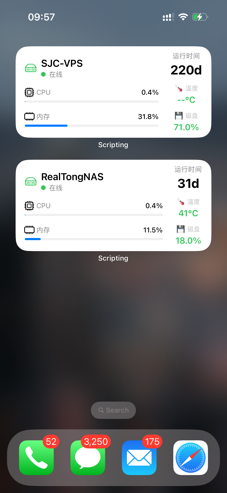
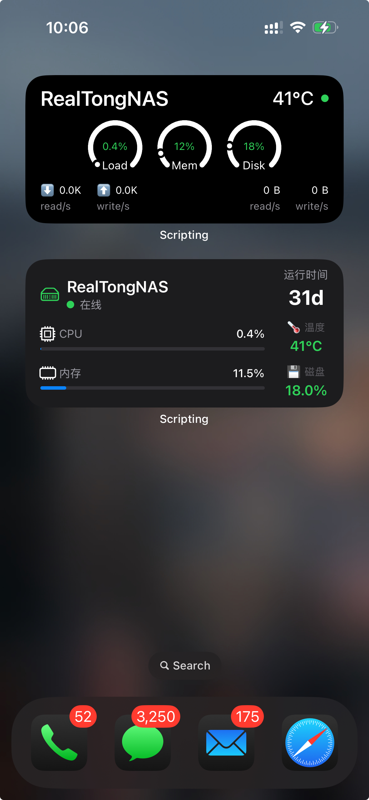

# Beszel-Weight

<details> 
    <summary>Demo</summary>


</details>

## Introduction

An iOS widget for monitoring [Beszel-Hub](https://beszel.dev/zh/) servers.

## Installation

1. Copy `widget.tsx` or `widget1.tsx` into the Scripting App.
2. Rename or modify the file as needed.

## Configuration Parameters

Long press the widget, edit the widget, and enter the following JSON in the Parameter field:

```json
{
  "beszelURL": "https://your-beszel-url",
  "apiToken": "your-pocketbase-api-token",
  "serverName": "your-server-name (the name in Beszel)"
}
```

- `beszelURL`: PocketBase service URL, e.g., `https://pb.example.com`.
- `apiToken`: PocketBase API Token (see below for how to obtain).
- `serverName`: The name of the server you want to monitor.

## How to Get PocketBase API Token

1. Log in to the Beszel admin panel.
2. Click your avatar in the top right → `System` to enter the PocketBase backend.
3. Click System → `_superusers` table, and find your account.
4. Click the `Impersonate` button in the top right.
5. Enter the token validity period and generate the token.
6. Paste it into the configuration above.

## Run

- Supports parameterized configuration for multi-server monitoring.

## Notes

- `widget.tsx` and `widget1.tsx` have different UI styles. Choose as needed.
- For custom UI, modify the corresponding tsx file.

---

For questions, contact RealTONG.
